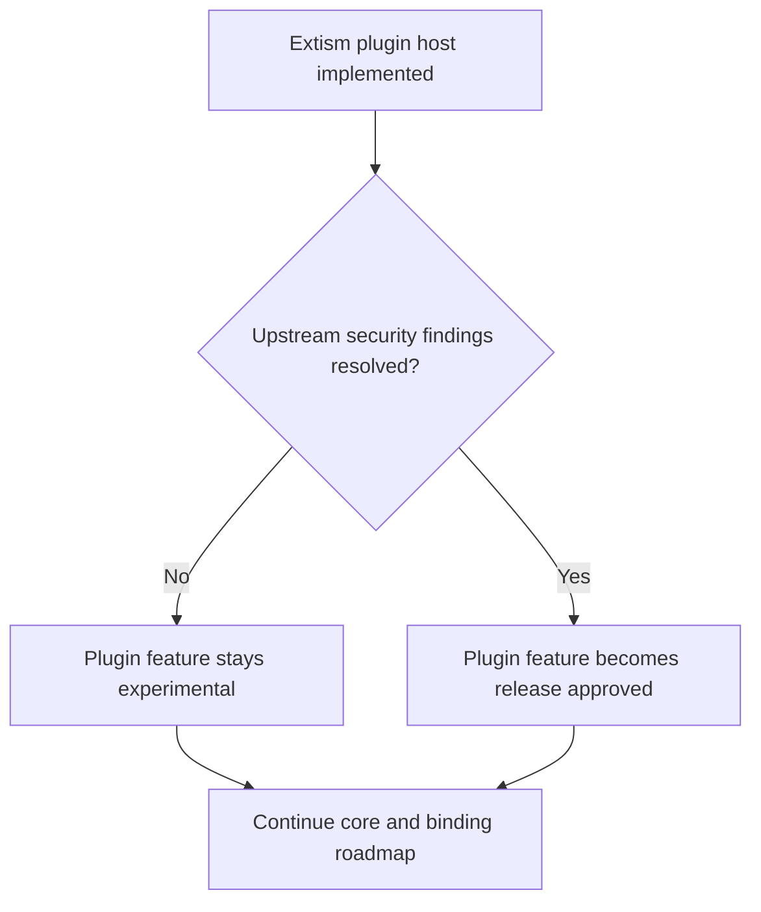

# 6. Plugin Runtime Release Gated Pending Upstream Remediation

Date: 2026-03-18

## Status

Accepted

Amends: [0003-wasm-based-plugin-system-via-extism](0003-wasm-based-plugin-system-via-extism.md)

## Context

Rivet now has a working Extism-based plugin host in `rivet-core`, and the plugin interface remains the design-aligned mechanism for custom metrics. However, the current Extism dependency chain pulls runtime dependencies that are still flagged by repository security checks, most notably the current Wasmtime line and `fxhash`.

This creates a release-management problem rather than an architecture problem:

- The plugin model is still the correct long-term design.
- The host implementation is useful for ongoing development and integration testing.
- The current dependency chain is not acceptable as a release-ready baseline for plugin-enabled published artifacts.

The project also needs to keep moving on the critical path from the system design document:

1. finish the 12-language query-driven core,
2. freeze its regression suite,
3. ship typed Python/Node bindings.

Blocking those milestones on upstream remediation would stall the product for the wrong reason.

## Decision

We will keep the Extism-based plugin host in the repository, but we will treat plugin-enabled release artifacts as **experimental and release-gated** until the upstream dependency chain is remediated.

Operationally, that means:

- `rivet-core` keeps the plugin host and SDK implementation.
- Normal workspace build and test paths continue compiling plugin code.
- Documentation and CI must distinguish between:
  - **core release-ready** surfaces: core library, CLI, MCP, LSP, and typed bindings
  - **plugin experimental** surfaces: available for development and local usage, but not yet release-approved
- Dedicated CI jobs may continue building the plugin SDK and WASM examples, but release automation must not claim plugin-enabled artifacts are cleared for publication.

We are not replacing Extism at this stage. The remediation decision remains open between:

- upstream upgrade,
- a maintained fork/patch strategy,
- or a different sandbox runtime if Extism cannot be brought back to a releasable security posture.

## Consequences

### Positive

- The system design stays intact: WASM plugins remain the sanctioned extension model.
- The repository can continue progressing on the critical path instead of waiting on upstream.
- CI and docs become honest about the difference between implemented and release-approved.
- Typed bindings and the 12-language product slice can be completed without redesigning the plugin surface.

### Negative / Risks

- The repository remains in a mixed state where plugin code exists but is not fully releasable.
- Contributors must understand the distinction between experimental and approved surfaces.
- Future release automation must keep the plugin gate explicit until the dependency chain is fixed.

### Follow-up

- Revisit this ADR when Extism or the surrounding runtime dependencies move to a security-clean baseline.
- At that point, either:
  - mark the plugin runtime release-approved, or
  - supersede this ADR with a replacement runtime decision.
